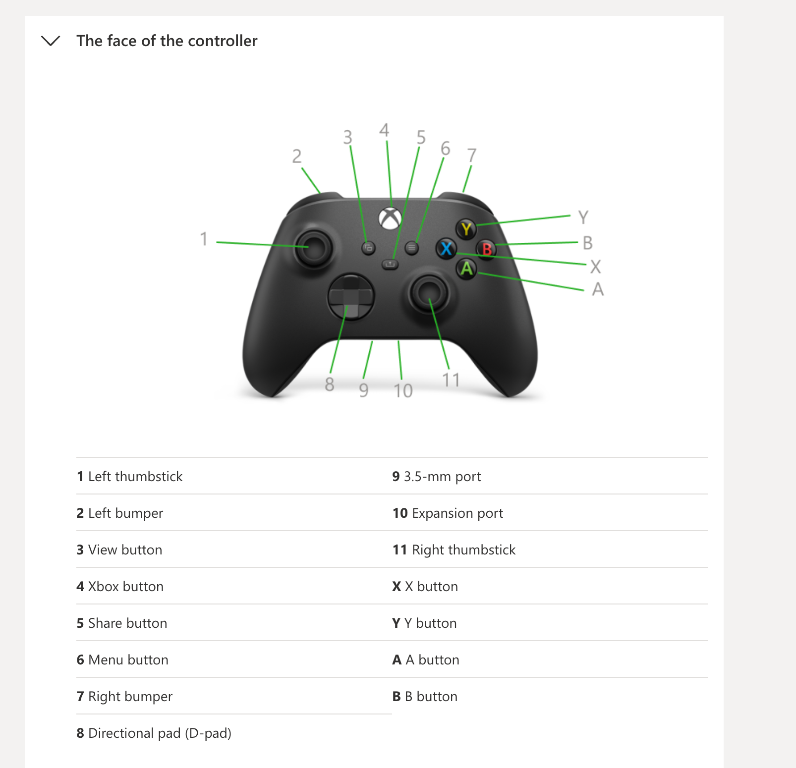

# Controller Mapping

## Button Mapping

| Xbox Button | Bluepad32 Constant | Robot Function |
|---|---|---|
| Left Stick Y | `axis_y` | Forward / Reverse |
| Left Stick X | `axis_x` | Turn left / right |
| Right Trigger | `throttle` | Weapon speed |
| View (3) | `MISC_BUTTON_SELECT` | Emergency stop toggle |
| Xbox (4) | `MISC_BUTTON_SYSTEM` | — (unused) |
| Share (5) | `MISC_BUTTON_CAPTURE` | — (unused) |
| Menu (6) | `MISC_BUTTON_START` | — (unused) |
| A / B / X / Y | `BUTTON_A` / `B` / `X` / `Y` | — (unused) |
| LB / RB | `BUTTON_SHOULDER_L` / `R` | — (unused) |
| D-Pad | `dpad` | — (unused) |

## Drive Mode

The robot uses **arcade drive** mapped to the left stick:

- **Y axis** controls forward/reverse speed
- **X axis** controls turning
- Both axes use exponential scaling for fine control at low speeds
- Proportional scaling ensures the turn ratio is preserved when either motor would exceed 100%

## Misc Button Constants Reference

| Constant | Bit | Xbox Name |
|---|---|---|
| `MISC_BUTTON_SYSTEM` | 0 | Xbox button (logo) |
| `MISC_BUTTON_SELECT` | 1 | View button (two squares) |
| `MISC_BUTTON_START` | 2 | Menu button (hamburger) |
| `MISC_BUTTON_CAPTURE` | 3 | Share button (arrow) |
